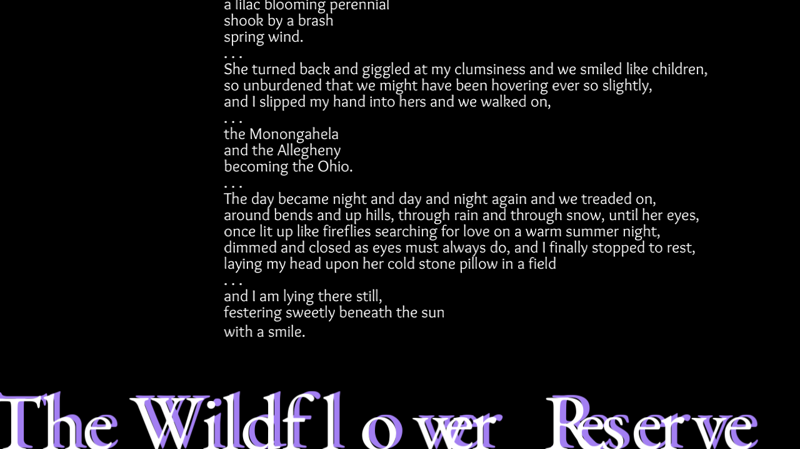

# Memories

Author: Scott King

Design: Take a walk through a poetry garden

Text Drawing: .ttf files are loaded by FreeType, info on each ASCII glyph is stored in a map, text is 
shaped at draw time by HarfBuzz unless the text being drawn hasn't changed, and all the code
for this is in TextRenderer.hpp/.cpp

Choices: All content is hard coded into PlayMode.hpp

Screen Shot:

Sources: Thanks to my past bandmates, Mark, Alan, and Jonathan, for playing in all of the background music. 

This game was built with [NEST](NEST.md).

